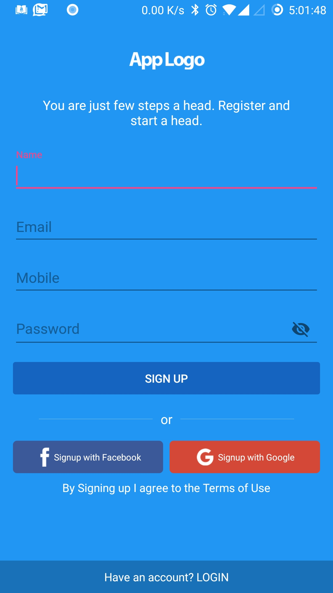
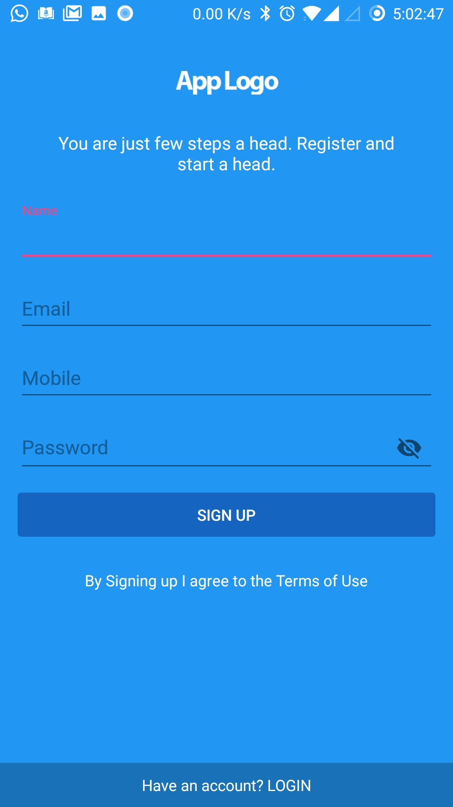
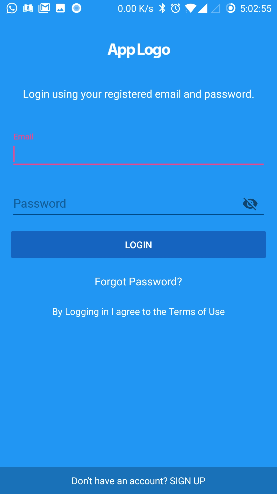
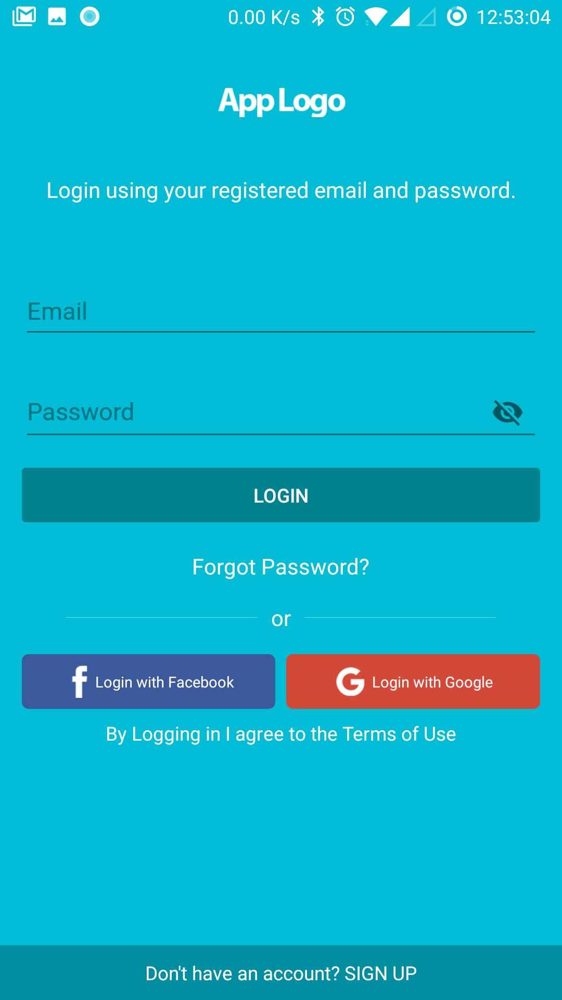
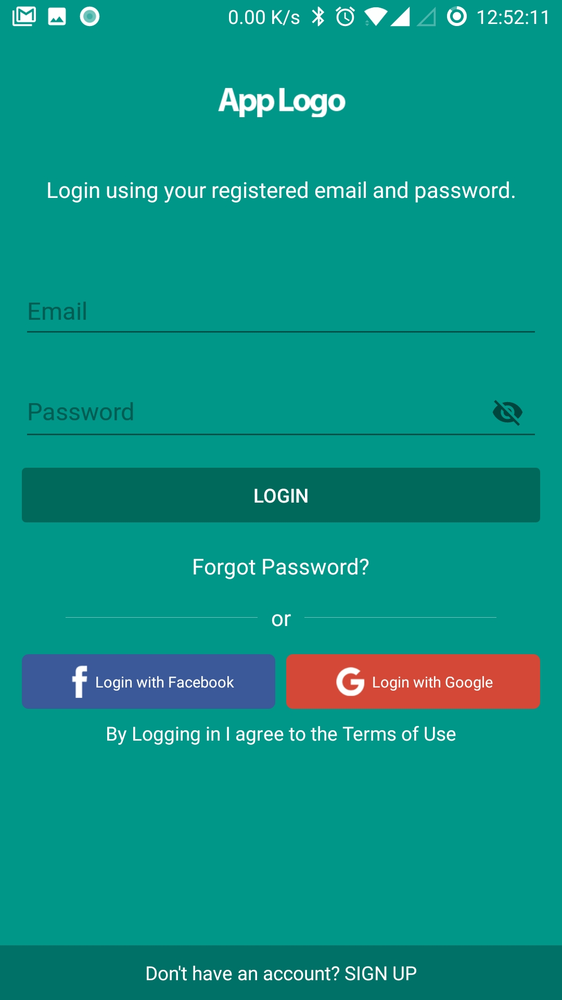
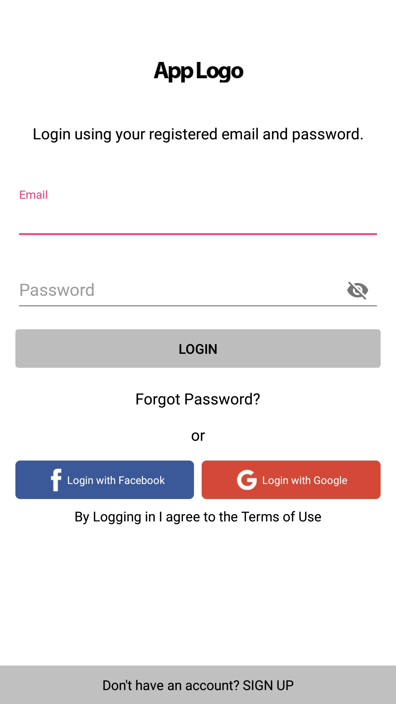

# auth-ui
Android App Auth(Login, Signup and Forgot Password) UI


[ ](https://bintray.com/sayagodshala/maven/auth-ui/_latestVersion)
[](https://www.apache.org/licenses/LICENSE-2.0.html)
[](https://travis-ci.org/sayagodshala/auth-ui)
[](https://android-arsenal.com/api?level=15)

# What's in the box

- The login, signup and forgot password UI framework for your app
- Easy way to implement
- Play with element visibility
- Setup material theme like Teal, Cyan, Indigo and many more.
- Hide and Show social logins.

<!--[ ](https://bintray.com/sayagodshala/maven/auth-ui/_latestVersion)-->
<!--[](https://www.apache.org/licenses/LICENSE-2.0.html)-->
<!--[](https://android-arsenal.com/details/1/5607)-->
<!--[](https://travis-ci.org/aromajoin/actionsheet-android)-->

<!--[](https://android-arsenal.com/details/1/3026)-->

<!---->

Basic Form | Signup without Social Platforms | Login without Social Platforms
---- | ---- | ----
 |  | 

### Themes

CYAN | TEAL | WHITE/DEFAULT
---- | ---- | ----
 |  | 

# Setup
## 1. Include in your project

### Using Gradle
The **Auth UI** library is pushed to jcenter, so you need to add the following dependency to your app's `build.gradle`.

```gradle
compile 'com.sayagodshala:auth-ui:1.0'
```

### As a module
If you can't include it as gradle dependency, you can also download this GitHub repo and copy the auth-ui folder to your project.


## 2. Usage

First step in configuring the Auth UI Framework is to place `FrameLayout Container` in your layout.

```xml
<FrameLayout
        android:id="@+id/frame"
        android:layout_width="match_parent"
        android:layout_height="match_parent"/>
```

Next step is to configure the `AuthUISettings`.

Example:

```java
AuthUISettings authUISettings = new AuthUISettings();
authUISettings.setSocialPlatformRequired(true);
authUISettings.setAppLogoRequired(true);
authUISettings.setTermsRequired(true);
authUISettings.setSignupRequired(true);
authUISettings.setFacebookLoginRequired(true);
authUISettings.setGoogleLoginRequired(true);
authUISettings.setForgotPasswordRequired(true);
authUISettings.setAppLogo(R.mipmap.my_logo);
authUISettings.setLoginTitle("Login using your registered email and password.");
authUISettings.setSignupTitle("You are just few steps a head. Register and start a head.");
authUISettings.setForgotPasswordTitle("Put in your email id for password reset link");
authUISettings.setLoginTerms("By Logging in I agree to the <b>Terms of Use</b>");
authUISettings.setSignupTerms("By Signing up I agree to the <b>Terms of Use</b>");
authUISettings.setFacebookLoginTitle("Login with Facebook");
authUISettings.setFacebookSignupTitle("Signup with Facebook");
authUISettings.setGoogleLoginTitle("Login with Google");
authUISettings.setGoogleSignupTitle("Signup with Google");
authUISettings.setLoginToggleTitle("Have an account? <b>LOGIN</b>");
authUISettings.setSignupToggleTitle("Don\'t have an account? <b>SIGN UP</b>");
authUISettings.setDefaultView(AuthUIView.LOGIN);
authUISettings.setMaterialTheme(MaterialTheme.CYAN);
```
Next step is to load the `AuthUIFragment` with settings in your Activity.

```java
AuthUIFragment.loadFragment(this, AuthUIFragment.newInstance(authUISettings), R.id.frame);
```

Final step is to implement `AuthUIFragment.AuthUIFragmentListener` interface in your target activity where `AuthUIFragment` is loaded with corresponding methods.

```java
public class LoginActivity extends AppCompatActivity implements AuthUIFragment.AuthUIFragmentListener {

    @Override
    public void onLoginClicked(String username, String password) {
        ...call your api
    }

    @Override
    public void onSignupClicked(String name, String email, String mobile, String password) {
        ...call your api
    }

    @Override
    public void onForgotPasswordClicked(String email) {
        ...call your api
    }

    @Override
    public void onFacebookClicked(boolean isRegistration) {
        if(isRegistration){
            ...signup facebook user(API)
        } else{
            ...login facebook user(API)
        }
    }

    @Override
    public void onGoogleClicked(boolean isRegistration) {
        if(isRegistration){
            ...signup google user(API)
        } else{
            ...login google user(API)
        }
    }

}
```
This is the simplest way to configure the library to enable Custom login mode along with Social Platform login modes.

**That's it!**

# More about AuthUISettings

To hide social platforms use below code

```java
authUISettings.setSocialPlatformRequired(false);
```

To hide App logo

```java
authUISettings.setAppLogoRequired(false);
```

In case your app only requires login

```java
authUISettings.setSignupRequired(false);
```

In case your app only requires one of the below

```java
authUISettings.setFacebookLoginRequired(false);
**OR**
authUISettings.setGoogleLoginRequired(false);
```

In case your app doesn't require forgot password

```java
authUISettings.setForgotPasswordRequired(true);
```

Set your default view

```java
authUISettings.setDefaultView(AuthUIView.LOGIN);
**OR**
authUISettings.setDefaultView(AuthUIView.SIGNUP);
```

Supported Themes (Default Theme is WHITE)

```java
authUISettings.setMaterialTheme(MaterialTheme.DEFAULT);
**OR**
authUISettings.setMaterialTheme(MaterialTheme.WHITE);
**OR**
authUISettings.setMaterialTheme(MaterialTheme.RED);
**OR**
authUISettings.setMaterialTheme(MaterialTheme.PINK);
**OR**
authUISettings.setMaterialTheme(MaterialTheme.PURPLE);
**OR**
authUISettings.setMaterialTheme(MaterialTheme.DEEP_PURPLE);
**OR**
authUISettings.setMaterialTheme(MaterialTheme.INDIGO);
**OR**
authUISettings.setMaterialTheme(MaterialTheme.BLUE);
**OR**
authUISettings.setMaterialTheme(MaterialTheme.LIGHT_BLUE);
**OR**
authUISettings.setMaterialTheme(MaterialTheme.CYAN);
**OR**
authUISettings.setMaterialTheme(MaterialTheme.TEAL);
**OR**
authUISettings.setMaterialTheme(MaterialTheme.BLUE_GREY);
```

# Included Libraries
The following third-party libraries were used in this framework.

- GSON library


# Contribution
All contributions are welcome. Encounter any issue? Don't hesitate to [open an issue](https://github.com/sayagodshala/auth-ui/issues)

Convention: **Master branch** would be the development branch. So feel free to fork from the Master branch.

# License

    Copyright 2017 Codelight Studios

    Licensed under the Apache License, Version 2.0 (the "License");
    you may not use this file except in compliance with the License.
    You may obtain a copy of the License at

       http://www.apache.org/licenses/LICENSE-2.0

    Unless required by applicable law or agreed to in writing, software
    distributed under the License is distributed on an "AS IS" BASIS,
    WITHOUT WARRANTIES OR CONDITIONS OF ANY KIND, either express or implied.
    See the License for the specific language governing permissions and
    limitations under the License.